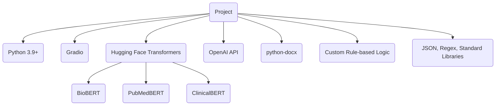
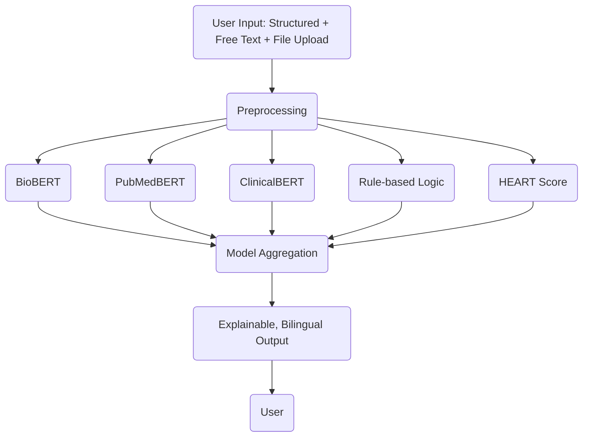

# Bilingual Cardiovascular AI Assistant

## Overview

This project is a bilingual (Chinese-English) AI-powered assistant for early cardiovascular risk screening. It combines structured inputs (questionnaires, vitals, lab values), free-text symptom descriptions, and uploaded lab reports. The system leverages multiple biomedical NLP models, rule-based logic, and clinical risk scores to classify user risk and generate explainable, culturally inclusive feedback. Designed for general users and low-resource settings, it’s deployable via lightweight Python apps and Hugging Face Spaces.

---

## Features

- **Bilingual UI (Chinese/English)**: All inputs and outputs are available in both languages, including dual-language medical terminology display.
- **Structured and Free-Text Input**: Users can enter symptoms, history, lab values, and additional concerns in free text.
- **Model Integration**: Uses three biomedical NLP models (BioBERT, PubMedBERT, ClinicalBERT) for risk classification.
- **Rule-Based Disease Logic**: Explicit rules for hypertension, CAD, MI, hyperlipidemia, and heart failure ensure clinical safety.
- **Model Aggregation**: Weighted aggregation of model outputs for robust, explainable results.
- **Lab Report Parsing**: Extracts and maps lab parameters from uploaded files (mock and real), with logic to reconcile overlapping values.
- **HEART Score Calculation**: Integrates a simplified HEART score for additional risk stratification.
- **Free Text Analysis**: Extracts keywords, flags inconsistencies, and can supplement structured data for risk analysis.
- **Explainable Output**: Structured, bilingual summaries with model explanations, clinical alerts, recommendations, and warnings.
- **ChatGPT/LLM Integration (Planned)**: Placeholder for LLM-powered report summarization.

---

## Technologies Used

- Python 3.9+
- Gradio (web UI)
- Hugging Face Transformers (BioBERT, PubMedBERT, ClinicalBERT)
- OpenAI API (for LLM summarization, optional)
- Docx parsing (python-docx)
- Custom rule-based logic
- JSON, Regex, and standard Python libraries

---

## Technologies Used Diagram



---

## Model Explanations

- **BioBERT**: Pre-trained on biomedical text, suitable for analyzing medical-related content.
- **PubMedBERT**: Trained on PubMed data, focuses on understanding biomedical literature.
- **ClinicalBERT**: Optimized for clinical text (e.g., electronic medical records), suitable for analyzing patient-related clinical data.

---

## Workflow Diagram



## Workflow Diagram (with Explanatory Notes)

```mermaid
flowchart TD
    A(User Input: Structured + Free Text + File Upload) --> B(Preprocessing)
    B --> C1(BioBERT\nML Model)
    B --> C2(PubMedBERT\nML Model)
    B --> C3(ClinicalBERT\nML Model)
    B --> D(Rule-based Logic\n(Explicit Clinical Rules))
    B --> E(HEART Score\n(Clinical Risk Score))
    C1 --> F(Model Aggregation)
    C2 --> F
    C3 --> F
    D --> F
    E --> F
    F --> G(Explainable, Bilingual Output)
    G --> H(User)

    subgraph Legend
      L1["ML Model: Machine learning model for risk prediction"]
      L2["Rule-based Logic: Explicit clinical rules for safety"]
      L3["HEART Score: Standard clinical risk score"]
    end
```

**Diagram Notes:**
- **ML Model**: Each of BioBERT, PubMedBERT, ClinicalBERT independently predicts risk.
- **Rule-based Logic**: Applies explicit clinical rules (e.g., emergency BP thresholds).
- **HEART Score**: Standardized clinical scoring for chest pain risk.
- All three approaches run in parallel and are aggregated for a robust, explainable, and safe final risk assessment.

---

## System Workflow

1. **User Input**: User selects language, enters symptoms/history/labs, adds free text, and/or uploads lab report.
2. **Preprocessing**: Inputs are normalized, free text is analyzed for keywords and inconsistencies, and lab files are parsed.
3. **Model & Rule Analysis**:
    - Structured summary is sent to three NLP models for risk prediction.
    - Rule-based logic and HEART score are calculated in parallel.
    - Free text can supplement or override structured data if higher risk is detected.
4. **Aggregation**: Model outputs are aggregated (weighted), and final risk is determined (HEART score can override if high).
5. **Output Generation**: Bilingual, explainable report is generated, including model explanations, clinical alerts, recommendations, and warnings.
6. **LLM Summarization (Planned)**: Output can be summarized by a large language model for clarity and personalization.

---

## Example Output

```
## 🩺 Overall risk
🔹 **Moderate Risk**

## 🚨 Clinical Alerts
- Angina symptoms present, please monitor heart health.

## 📊 Model Probability Distribution
### 🔸 BioBERT
- Moderate Risk: 0.41
- High Risk: 0.34
### 🔸 PubMedBERT
- High Risk: 0.34
- Moderate Risk: 0.41
### 🔸 ClinicalBERT
- Moderate Risk: 0.51

## ❤️ HEART Score: 2 points (Moderate Risk)
## ⚖️ Weighted Risk Scores
- Low Risk: 0.12
- Moderate Risk: 0.44
- High Risk: 0.38

## 🩺 Clinical Recommendations
- It is recommended to consult a doctor soon for further cardiac evaluation.

## 💬 Model Explanation
### BioBERT
BioBERT is a model pre-trained on biomedical text, suitable for analyzing medical-related content.
### PubMedBERT
PubMedBERT is trained on PubMed data and focuses on understanding biomedical literature.
### ClinicalBERT
ClinicalBERT is optimized for clinical text (such as electronic medical records) and is suitable for analyzing patient-related clinical data.

## 📝 Input Summary
... (user input summary) ...
```

---

## Safety & Explainability

- **Inconsistency Warnings**: If free text suggests higher risk than structured input, the system warns the user.
- **Dual-Language Display**: All medical terms and recommendations are shown in both Chinese and English.
- **Rule-Based Overrides**: Emergency findings in rules or free text can override model outputs for safety.

---

## Future Directions

- Integrate real LLM (e.g., GPT-4, Claude) for advanced free text extraction and summarization.
- Expand lab report parsing to more formats and languages.
- Add user feedback and continuous learning loop.

---

## License

MIT

## LLM Summarization

The system supports live LLM (Large Language Model) summarization for generating concise, user-friendly reports. When enabled, model outputs are sent to an LLM (such as OpenAI's GPT-4) via API for real-time summary generation. This replaces the previous mock summary and provides more accurate, context-aware explanations.

- **How it works:**
    - The function `summarize_model_outputs` now calls a real LLM API instead of returning a mock summary.
    - Requires a valid API key and internet connection.
    - Summaries are generated dynamically based on the user's input and model results.

- **Configuration:**
    - Set up your API key in the environment or configuration file as described in the code comments.
    - Ensure the `mock` parameter is set to `False` to enable live summarization.
